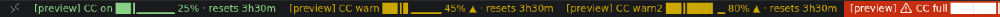
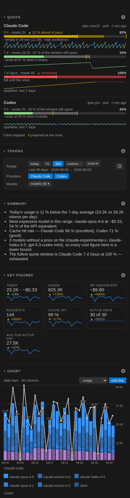

# Token Pace — Claude Code & Codex

Quota, tokens and API cost for **Claude Code** and **Codex**, permanently in the VS Code
status bar, with a detailed tooltip, a dashboard in the secondary sidebar, and text-only
views for the places a webview cannot go.

The bars are coloured by **pace**, not by level: green while consumption stays at or below
the share of the window that has already elapsed, yellow once it runs ahead of pace,
red when the window is spent. A 60 % bar is reassuring an hour before the reset and alarming
five minutes in — a fixed threshold cannot tell those apart.

```
CC 5h ██┃▁▁▁▁▁ 25% · resets 2h14m      CC 7d █████┃▁▁ 69% ▲ · resets 4d 6h
CDX 5h ███┃▁▁▁▁ 33% · resets 1h05m     CC Fable 7d █┃▁▁▁▁▁▁ 12% · resets 4d 6h
Σ 4.6M · today                         ~$1.23 · today
```





Both pictures are rendered from **preview data** (*Token Pace: Preview Status Bar States*
and a synthetic snapshot), not from anybody's real usage. The tooltip behind the bar is
described in full under [Tooltip](#tooltip).

One entry per quota window, including the model-scoped ones. `tokenPace.windowSelect` decides
how many of them appear — out of the box `worstPace`, which gives each tool the single window
that needs attention, while `all` puts every window in the bar. `tokenPace.statusBar.show`
decides which kinds of entry exist at all **and in which order**, and `tokenPace.density`
decides how much text each one gets. Every state the bar can show is listed in
[docs/status-bar-states.md](docs/status-bar-states.md).

**Out of the box this extension makes no network access at all.** Token counts are read from
local transcript files. Quota percentages come from the provider, and out of the box they are
read from local sources somebody else wrote — a cache file, Claude Code's own status line,
`~/.claude.json`, the Codex transcripts. Fetching them ourselves is a separate decision, asked
for once, in a dialog that states exactly what is sent where — see
[Quota sources](#quota-sources). No usage data is collected, and nothing is written outside
the extension's own storage unless you turn on one of the two opt-ins and confirm its dialog.

**Requires VS Code 1.106 or newer.** The dashboard lives in the secondary sidebar, and
`contributes.viewsContainers.secondarySidebar` only became a stable contribution point in
1.106 (in 1.104 it was behind the `contribSecondarySideBar` proposed API). Editors built on an
older VS Code base — Cursor and Windsurf currently are — cannot install it until they rebase;
VSCodium tracks the VS Code releases and gets it from Open VSX.

Not affiliated with, endorsed by, or sponsored by Anthropic or OpenAI. “Claude” and “Codex”
are the trademarks of their respective owners and are used here only to name the tools whose
output is read.

## Where the numbers come from

| Display | Source | Confidence | Freshness |
|---|---|---|---|
| Claude quota %, reset, model windows | external cache file (default `~/.cache/claude-usage/state.json`) | exact — the provider's own response | the writer's `fetched_at`; can be hours |
| the same | status-line mirror, if you installed the bridge | exact | every status-line refresh of Claude Code |
| the same | `cachedUsageUtilization` in `~/.claude.json` | exact | Claude Code's own cache; discarded above 24 h |
| the same | our own fetch of `api.anthropic.com/api/oauth/usage` | exact | `pollIntervalMinutes` (default 30) — consent required |
| Codex quota %, reset, credits | external cache file (default `~/.cache/codex-usage/state.json`) | exact | the writer's `fetched_at` |
| the same | the `rate_limits` block Codex writes into its own transcripts | exact | as old as your last Codex turn — the age is always shown |
| the same | the local `codex app-server` (`account/rateLimits/read`) | exact | poll interval — consent required |
| Tokens per hour / day / model | `~/.claude/projects/**/*.jsonl` | exact | on file change |
| Tokens per hour / day / model | `~/.codex/sessions/**/rollout-*.jsonl` (and `archived_sessions/`) | exact | on file change |
| Output of Claude subagents, and of any response with no terminal line | the same transcripts | **lower bound** (⚠ in tooltip, table and export) | – |
| API cost | token counts × a dated price table | **estimate** (`~`) | table checked 2026-09-02 |
| Burn rate, ETA, end-of-window, reset retrospective | the stored quota history | **estimate**, with a stated confidence and “based on *N* readings” | needs several readings |
| Tokens per percentage point (calibration) | quota history ÷ local tokens | **observation about your data**, off by default | – |

For Claude the windows come from the response's `limits[]` array, not from the top-level
fields: only there do the model-scoped quotas appear (`kind: "weekly_scoped"` with
`scope.model.display_name`). The older top-level shape (`five_hour`, `seven_day`,
`seven_day_opus`, …) is still read as a fallback.

The percentages come from each provider's server and cover **all** clients — desktop app and
browser included. They cannot be derived from the local token counts, and the extension
never suggests otherwise.

“Usage” means fresh input + cache write + output. Cache reads are listed separately because
they would otherwise dominate the total by a factor of ~1000.

Absence is never drawn as a number: a missing figure is `–`, never `0 %` or `$0.00`; a window
without a stated length gets no pace and no forecast rather than an invented denominator; a
day with no data has no row in an export rather than a row of zeros.

## Words used here

Nine terms carry most of the meaning in this extension. Each is used in exactly one sense, in
the status bar, the tooltip, the dashboard and the exports alike.

| Term | What it means |
|---|---|
| **Window** | One quota bucket of a provider, with a length and a reset time: Claude's 5-hour session, its 7-day plan window, a model-scoped 7-day window, Codex's 5-hour and 7-day limits. Every figure belongs to a window; nothing is ever summed across two |
| **Pace** | Consumption compared with the share of the window that has **already elapsed**, not with a fixed threshold. `ratio = (used ÷ limit) ÷ (elapsed ÷ window)`; `1.0` is exactly on pace |
| **Ahead of pace / spare** | The same relation as a difference of percentages (`used % − elapsed %`). Above the line it reads `5 % ahead of pace`, below it `36 % of the window still spare`. The unit is percentage points of the window, written `%` — the same sign as the figure above it |
| **Elapsed marker** | The `┃` inside the bar, at the position the window's own clock has reached. Fill left of it is spare, fill right of it is ahead of pace. It is what makes the verdict readable without colour. The dashboard bar also paints the gap: fill beyond the marker is drawn in a darker shade of the level colour, and track between the end of the fill and the marker in a stronger grey than the rest of the track |
| **Lower bound** | A figure that is certainly *at least* this large but may be larger: output of Claude subagents, and of any response with no terminal line, is counted but cannot be counted completely. Marked `⚠` in the tooltip, the tables and the exports, and never quietly rounded up |
| **Provenance** | Where a number came from and how sure it is. Every view carries it: `measured: quota, tokens · estimated: ~API cost`, and per model `exact` / `family` / `custom` / `none` |
| **Poll vs cache** | *Poll* is a request Token Pace makes itself, with your access token, after consent. *Cache* is a reading somebody else already fetched — a cache file, Claude Code's status line, `~/.claude.json`, the Codex transcripts. Cache costs nothing and touches no network; its age is always shown |
| **Forecast state** | The named answer a forecast gives instead of a bare number: `none`, `full`, `stale`, `measuring`, `idle`, `resetsFirst` (`~ends at 62 % when it resets`) or `eta` (`~empty in 3.2 h (15:42) · medium confidence`) |

## Pace, not level

Each bar carries a tick marking how much of that window's own time has already passed, and
the colour compares consumption against that tick rather than against a fixed threshold.

The verdict is one ratio:

```
ratio = (used ÷ limit) ÷ (elapsed ÷ window)
```

`1.0` is exactly on pace; above `1.0` you are consuming faster than the window refills. The
same relation is stated as a **difference of percentages** (`used % − elapsed %`), because that
number stays readable near the start and the end of a window where the ratio explodes towards
infinity. The unit is percentage points of the window, and it is written `%` — the same sign as
the figure above it. The tooltip always names the difference, tolerance or not.

Two guards keep the verdict honest:

* **Tolerance band.** A window has to run more than *n* points ahead of pace before it is
  coloured at all — otherwise the bar would flip colour on rounding noise.
* **Minimum elapsed.** Right after a reset `elapsed ≈ 0`, so the ratio explodes and the very
  first prompt would always look too fast. Below the minimum the verdict is `measuring`: the
  bar stays green and the views print no pace text at all until the window has run long
  enough to judge.

`tokenPace.pace.sensitivity` picks the pair:

| Preset | Tolerance | Minimum elapsed | ≈ ratio at mid-window |
|---|---|---|---|
| `relaxed` | 10 points | 5 % | 1.2 |
| `normal` (default) | 5 points | 3 % | 1.12 |
| `strict` | 2 points | 1 % | 1.05 |
| `custom` | `pace.tolerancePoints` | `pace.minElapsedPercent` | – |

| Colour | Meaning |
|---|---|
| 🟢 green | usage at or below the elapsed share plus the tolerance — on pace |
| 🟡 yellow (▲) | usage ahead of pace beyond the tolerance |
| 🟡 amber (▲▲) | more than three times the tolerance ahead — only with `pace.levels: graded` |
| 🔴 red | the window is spent (≥ 99.5 %); the status bar entry also gets an alarm background |

Exhaustion outranks everything: a full window is a fact, not a tendency. The verdict text is
one of `on pace`, `5 % ahead of pace`, `36 % of the window still spare`,
`no clock for this window`, `exhausted` — or nothing, while the window is still measuring.

An absolute level says little on its own: 80 % used is comfortable six days into a weekly
window and alarming six hours in. Real numbers from one session:

```
CC 5 h     98 % used · 82 % elapsed   → yellow ▲
CC 7 d     40 % used · 80 % elapsed   → green
CDX 7 d   100 % used · 10 % elapsed   → red
```

Windows that report no reset time have nothing to compare against; they stay green until
they are spent.

## Status bar

### What an entry is made of

```
[state glyph] LABEL WINDOW [bar] VALUE [indicator] [· resets …] [$(history) age]
   $(warning)   CC    5h   ██┃▁▁▁▁▁  25%     ▲      · resets 2h14m   $(history) 12m
```

* **Entries.** `tokenPace.statusBar.show` is an ordered array of `claudeQuota`, `codexQuota`,
  `extra`, `context`, `tokens`, `cost`, `forecast`, `budget`. The array order is the display
  order (drag the rows in the settings UI); the order *inside* one entry is fixed. An empty
  list hides the status bar entirely. `context` is off by default and appears only while the
  Claude Code status line is connected — it is one session's context window, never an account
  figure. `budget` is off by default too and shows the configured budget closest to its own
  limit (`budget 63 %`, `budget ~63 %` for a money budget, `budget 118 % over`); the tooltip
  lists all of them.
* **Density.** `full` (default) gives every window its own entry, `compact` folds a provider's
  windows into one item (`CC 25%·2h14m | 69%·6d`), `minimal` folds every provider into a
  single `TP 69% ▲`. Problem states are never folded — a named cause is the point.
* **Window selection.** `tokenPace.windowSelect`: `worstPace` (the worst pace verdict, and within
  one verdict the most-utilised of those windows — the default, so each tool contributes exactly
  one entry), `all` (every window, up to nine entries), `leading` (the most-utilised window per
  tool), `session`, `weekly`, or `auto`. **The `auto` rule:** session windows only, unless *every*
  session window is below **30 %**, in which case every window is shown. The tooltip states
  what `auto` decided and why. A filter that would match nothing falls back to the full list.
  *Token Pace: Cycle Status Bar Windows* steps through the values without opening settings.
* **Bar.** `barWidth` (0–20, default 8; `0` leaves the percentage), `barStyle` (`line` /
  `shade` / `none` — how the *empty* part is drawn), `barGlyphs` (`blocks`, `shapes`, `dots`,
  `pie`). All four glyph sets exist because block elements are not shipped in every status bar
  font; each set stays inside one Unicode block so the bar cannot jitter between fallbacks —
  which is also why `line` and `shade` differ only for `blocks`: `shapes` and `dots` draw their
  own empty glyph (`□`, `○`), `pie` has no empty part, so there only `none` changes anything.
* **Time marker.** `timeProgressStyle`: `marker` (the `┃` sits where the window's own clock
  stands — needs a width of at least 6), `bar` (a second track underneath), `none`. This is
  what makes pace readable **without colour**: fill left of the marker is reserve, fill right
  of it is ahead of pace.
* **Indicator.** `tokenPace.indicator` decides whether the verdict is signalled by `color`,
  `glyph` (`▲` / `▲▲`), `both` (default) or `none`. Colour alone is invisible to red-green
  colour blind readers and disappears in themes that tint the whole status bar.
* **Remaining mode.** `percentMode: remaining` turns the number into what is left and mirrors
  the bar; the choice is carried through item, bar direction, tooltip header and legend.
  `used` is rounded, `remaining` is floored, so neither mode ever claims headroom that is not
  there.
* **Countdown.** `resetFormat`: `none`, `relative` (`45m`, `2h14m`, `3d 5h`), `absolute`
  (`06:00`, with a weekday prefix beyond a day), `both`. `resetHourCycle` picks 12- or
  24-hour, `auto` follows the OS locale. The countdown is always introduced by the word
  `resets` — a bare `· 2h14m` would read like the age suffix, and the two move in opposite
  directions. A window whose provider states no reset time gets **no** countdown, ever.
* **Age.** `showAgeInItem`: `never`, `whenStale` (default), `always`. The age is recomputed at
  every redraw, so it never freezes at the value it had when it was fetched. A reading older
  than `staleAfterMinutes` (default 20) is greyed with `tokenPace.stale`, marked in the
  tooltip, loses its alarm background, and may not raise an alert.
* **Labels.** `tokenPace.labels` overrides the provider prefix (`claude`, `codex`, and
  `summary` for the collective item) or a single window by its id — `session:300`,
  `weekly_all:10080`, `weekly_scoped:10080:fable`, `codex:300`, `codex:10080`. Values are cut
  at 40 characters. Labels *we* derive are shortened to `labelMaxChars`; a label you set
  yourself is never shortened.

### Special states

| Text | Meaning |
|---|---|
| `$(warning) CC 5h ██████┃█ 100% exhausted · resets 47m` | exhausted (≥ 99.5 %) — alarm background; the state is also said in words, because the icon and the background can both be switched off, and every countdown is named `resets`, so it can be read neither as a percentage nor as the reading age |
| `⛔ CC 5h ████████ 100% limit reached` | the provider itself reports the limit as reached — a flag, not a derivation |
| `CC 5h ████████ 111%` | above 100.5 %: usage billed beyond the plan. `overflowDisplay: clamp` shows `100%` instead — the figure is real, not a rounding error |
| `CC 7d ∞ · resets 3d 5h` | a window or credit pot without a limit: no bar and no pace, because there is no denominator |
| `CC 5h ▁▁▁▁▁▁▁▁ reset due` | the reset has passed and no reading newer than it has arrived. The gauge is never set to 0 by us; a re-poll is scheduled instead |
| `CC extra $12.00 of $50.00 · 24 %` | extra usage, in its own blue |
| `CC $(graph) 5h ~empty in 40m` | the forecast entry — an estimate, and it carries `~` |
| `Σ 4.6M · today` / `Σ 12.3M · 7d` | tokens for `summary.period` and `summary.scope`; the period is always named |
| `~$1.23 · today ⚠` | hypothetical API cost; `⚠` means some tokens have no price and are missing from the sum |
| `$(shield) CC consent`, `$(key) CC no token`, `$(cloud-offline) CC offline`, … | a named cause replaces the figure, and the click performs the repair for *that* cause |

The full matrix — every text, which state wins, which colour, and the one thing to check —
is [docs/status-bar-states.md](docs/status-bar-states.md).

### Clicking

`tokenPace.clickAction` is `dashboard` (default), `menu`, `refresh` or `openWebsite`. In a
problem state the click always performs the repair step for that cause instead — the table in
[If the bar says …](#if-the-bar-says-) lists which. *Token Pace: Show Actions Menu* is a
QuickPick with every action, including *Show usage as text (Markdown)*; an action the current
state cannot perform stays in the list and says why
(`disabled: another VS Code window holds the lease and polls`) rather than disappearing.

### Tooltip

`tokenPace.tooltip`: `full`, `compact` (title, window table, freshness, footer — at most
twelve lines) or `off`. The full tooltip carries the window table
`Window | Used | Elapsed | Pace | Resets`, a forecast line per window that has one, the `auto`
explanation, extra usage, the freshness line (`Updated 3 min ago · cache file`), token tables
for today / 7 days / 30 days, the composition and cache-hit line, a provenance line
(`measured: quota, tokens · estimated: ~API cost`), the explanatory paragraphs, and the action
footer. `tooltipExplanations` is **off** by default — the paragraphs are worth reading once,
not on every hover; `true` brings them back. The uncertainty markers (`~`, `⚠`) and the
provenance line are never hidden by it.

Only this extension's own argument-less commands are ever linked from the tooltip, and a link
that would do nothing in the current state — *Fetch now* while consent is denied, in
`quotaSource: cache`, or while another window polls — is rendered as plain text instead of
pretending.

### Colours

Four contributed theme colours, overridable in `workbench.colorCustomizations`:

```jsonc
"workbench.colorCustomizations": {
  "tokenPace.paceOk":    "#89D185",  // on pace, or spare left over       (dark default)
  "tokenPace.paceWarn":  "#CCA700",  // ahead of pace beyond the tolerance
  "tokenPace.paceAhead": "#D18616",  // second level, only with pace.levels: graded
  "tokenPace.stale":     "#8B8B8B"   // reading older than staleAfterMinutes
}                                    // stale defaults to descriptionForeground
```

Each colour ships a default for all four theme variants; the values above are the dark ones,
except `tokenPace.stale`, which follows the theme's `descriptionForeground` unless you set it.

`colorMode: monochrome` drops the colours entirely and leaves the signal to the glyphs. The
alarm background of an exhausted window is not a colour setting and stays either way.

### Previewing

**Token Pace: Preview Status Bar States** renders synthetic versions of every state into their
own `tokenPace.preview.*` items, each marked `[preview]`, using your current format settings —
so a glyph set or a bar width can be judged without waiting for the state to happen for real.
It ends after 60 seconds, on a click, or when the command is run again. It reads no file,
writes no file, and never mixes with the live items.

## Dashboard

*Token Pace: Open Dashboard* (`ctrl+alt+shift+t`, `cmd+alt+shift+t` on macOS, unless
`tokenPace.keybindings` is off) opens the panel in the secondary sidebar. It needs
**VS Code 1.106 or newer**, for the reason given at the top of this file.
`tokenPace.dashboard.sections` is an ordered array — the array order is the render order. The range, provider and model chips filter the statistics, not the quota cards, so the filter bar sits below every `quota` and `context` card that leads the list and above the first section the filter applies to:

| Section | Contents |
|---|---|
| `quota` | One card per provider: the plan name and the reading's age in the header, then per window one header row (label, reset, pace verdict, percentage) over a bar with the elapsed tick, the pace gap painted on either side of it and a second tick for the projected value at the reset, the forecast line, a seven-day sparkline coloured by pace, and extra usage. The full freshness row (last check · last data · last local event · next refresh · snapshot age) and the official page stay in the markdown view; the tooltip keeps the reading's age and links the official page from the provider name. A provider that reports no window at all gets one local five-hour estimate instead, labelled as one |
| `summary` | Three to five rule-based sentences, each with its figure and the basis it came from. No advice — only measurements |
| `context` | The context window of the current Claude Code session as the status line reported it — tokens, and a share only when the payload named a window size. Off by default; nothing here is derived from the token counts |
| `kpis` | Today (usage, and its cost while `showCost` is on), then usage, API equivalent, requests, cache hit, active days, Avg per active day — each with a delta against the previous period and a sparkline |
| `tokens` | Totals table (usage, fresh input, cache write 5 m / 1 h, cache read, output, reasoning, requests, hit rate, per request, API cost), the composition bar, cache economy, calendar periods and the plan factor |
| `chart` | Stacked daily (or weekly) bars for the selected range, stacked by provider or by model, with a metric selector and an optional cost line on a second axis. Clicking a column drills into that day |
| `models` | Per-model breakdown with the same columns as the totals table (usage, fresh input, cache write 5 m / 1 h, cache read, output, reasoning, requests, hit rate, per request, API cost) plus the share of the range; every column sortable, with average and P90 turn length where enough samples exist. Where the rates came from is the tooltip of the cost, not a column |
| `heatmap` | Calendar heatmap of the last 53 weeks with current and longest streak, active days, peak day and a variability measure. Days outside the coverage are dotted, not empty |
| `hours` | Hour-of-day profile and a weekday × 4-hour grid, captioned with the weeks of usage days it stands on. A block nothing was ever done in is hatched |
| `records` | Records of the selected range: peak day, longest run of days with usage, and the top models, projects and sessions (`dashboard.topN` rows each). Off by default; the two lower tables need `tokenPace.attribution` |
| `tools` | Tool calls of the selected range by name, with the share of the calls counted in it and the models that made them (`dashboard.topN` rows). Off by default; names only, never a tool's input or its result, and the section states the day counting started |
| `budget` | Your own limits from `tokenPace.budgets`: used, limit, share against **that** number, and the end-of-period projection. Off by default; a period with no local data shows a dash, and no budget is ever added to another |
| `forecast` | Burn rate, exhaustion forecast, end-of-window projection, local usage inside the running window, and per-project attribution inside it |
| `history` | Reset retrospective: how often the window was exhausted, how much was left over |
| `projects` | Per-project breakdown — needs `tokenPace.attribution` |
| `sessions` | Per-session breakdown — needs `tokenPace.attribution: session` |
| `dataQuality` | Roots, file counts, coverage, bucket counts, retention, quota history size, every source with its age or its failure, drift, calibration, bridge state, consent, role — plus buttons for the export and diagnostics commands |

Defaults omit `context`, `records`, `tools`, `budget`, `history`, `projects` and `sessions`; `projects` and `sessions` stay
empty until attribution is switched on and say so instead of showing an empty table, and
`context` says how a reading could be had instead of inventing one.

**Ranges.** Chips for `today`, `yesterday`, `7d`, `30d`, `90d`, `thisWeek`, `thisMonth`,
`lastMonth`, `year`, `all`, plus two date fields for a custom range (capped at five years, and
a reversed range is swapped rather than returned empty). The date fields stay hidden until you
open them with the `custom…` chip, or until the range actually is a custom one, so the common
case is chips only. `dashboard.defaultRange` is the
starting point; the range you pick is remembered for the session. `all` starts at the first
day actually ingested, never earlier.

**Filters and sorting.** Provider toggles, up to twelve model chips — folded behind a
`models (N)` toggle above four, because a long chip row pushes the figures off the panel — and a
model table sortable by every column it shows (`model`, `usage`, `freshInput`, `cacheWrite5m`,
`cacheWrite1h`, `cacheRead`, `output`, `reasoning`, `requests`, `cacheHit`, `perRequest`, `cost`,
`share`, ascending or descending).
Chart metrics: `usage`, `output`, `cacheRead`, `requests`, `reasoning`, `cost`. The chart also
stacks either **by provider** or **by model** — by model it draws the five largest models of the
range in their own colours and folds the rest into one `other` band, so the column total is the
same either way. The heatmap switches between `usage` and `cost`; the hour profile between local
time and UTC.

**Collapsing.** Every section header is a toggle. What you collapse is remembered with the rest
of the view state (range, sort, filters), so a panel you have trimmed to two sections opens that
way again. `tokenPace.dashboard.sections` decides what exists at all; collapsing decides what
you look at today.

**Peak hours.** No fixed peak windows are built in. The profile is drawn from your own hour
buckets and nothing else, and rolled-up days that no longer have an hour are named as excluded
instead of being folded into the picture. The weekday × 4-hour grid draws every block a day of
usage reached, however few days there are, and hatches the blocks no day reached — “hatched: no
usage in that block”, said under the grid rather than left to be guessed. How thin the evidence
is, is the caption: the days that carry usage, rounded up to whole weeks, as *based on 1 week — a
record, not a habit* below three weeks and *based on 4 weeks* from three weeks on. The weeks are
counted from your usage days, not from the length of the range: four working days inside a month
are four days of evidence, not four weeks of them.

**Forecast states.** Every answer is a named state, never a bare number: `none` (nothing
measured), `full` (already exhausted), `stale` (the newest reading is too old to extrapolate),
`measuring` (too few readings, too short a span, or too little of the window elapsed), `idle`
(flat or falling), `resetsFirst` (`~ends at 62 % when it resets`) and `eta`
(`~empty in 3.2 h (15:42) · medium confidence`). Confidence is `low`, `medium` or `high` from
the number of readings and the span they cover, and the basis is spelled out — “based on 9
readings over 2.4 h”. A forecast that would land after the reset is never emitted. The fit uses
only the current cycle, and restarts at a limit re-basing, so neither a reset nor a raised
limit bends the slope.

**Reset retrospective.** Over completed cycles: how often the window hit the limit, and the
average share of the window left unused at the reset. Below three complete cycles it says
`not enough data yet` and names how many it has. Incomplete cycles stay visible as incomplete
rather than being counted — VS Code is not running all day, and a cycle seen through three
readings would understate its peak.

**Cache economy.** A counterfactual, and labelled as one: what the cache reads would have cost
at the input rate, minus what the writes cost (Codex bills no cache write). Plus the hit rate
and a blended $/1M.

**Previous-period deltas.** Every KPI carries a change against the immediately preceding span
of equal length. Growth from nothing reads `new`, not an infinite rise; a change below half a
point gets a neutral dot rather than an arrow that flips on noise. `all` has no predecessor and
gets no delta.

The colour of a delta comes from what the change **means**, never from its sign: more usage,
more cost and more requests are marked as the bad direction, a higher cache hit rate as the good
one, and active days and the per-day average carry no judgement at all and stay neutral. A green
arrow therefore never has to be read twice.

**Calendar periods and the month projection.** This week, this month, last month and this year,
each with usage, cost, requests, active days and Avg/day. The month projection extrapolates the
cost per *elapsed* day over the days left and shows its derivation
(`so far $41.20 · Avg $2.06/day · 11 days left`). Below five active days it stays silent.

**Plan factor.** With `tokenPace.planPriceUsd` set (`{"claude": 100, "codex": 20}`), one line
says how many times over the hypothetical API cost exceeds what you pay. Leave it empty and the
line is simply absent — Token Pace never guesses a plan price.

**Calibration.** `tokenPace.calibration.show` adds how many local usage tokens correspond to one
percentage point of a quota window, derived from your own history as a band (median, minimum,
maximum). It is an observation about your data, not a published conversion, and it is never
applied as a multiplier to anything. Off by default because it invites over-interpretation.

**Other views.** `tokenPace.dashboard.mode` switches *Open Dashboard* and the status bar click
between `webview`, `quickPick` and `markdown`. **Show Usage (Quick Pick)** is a flat, searchable
list; **Show Usage as Text** opens a read-only markdown document. All three read the same view
model, so the numbers cannot drift apart, and a test counts the rows of one against the other.

**Accessibility.** Bars are `role="progressbar"` with `aria-valuenow` and a spoken
`aria-valuetext`; sortable headers carry `aria-sort`; toggles carry `aria-pressed`; chart
columns are focusable buttons. The webview loads no external resource of any kind — its CSP
allows exactly one nonced inline style and script, and the chart, heatmap and sparklines are
CSS and inline SVG. Everything the webview sends back goes through an allow-list that accepts a
range, a sort, a filter, a metric, a drill day, a section toggle, or one of a fixed list of named
commands — never a path and never a setting. Where a webview is unavailable or unwanted, the QuickPick and markdown views
carry the same figures.

## Quota sources

`tokenPace.quotaSource` decides whether a fetch of our own may happen at all. It behaves the
same on every platform:

| Value | Behaviour |
|---|---|
| `auto` (default) | Local sources only, **no network access of its own**. If none of them has data, it offers **once** to switch to `poll` |
| `poll` | Fetches directly — but only after you have agreed in the dialog below |
| `cache` | Local sources only, never fetches and never asks |

Within that, `tokenPace.claudeQuotaSources` and `tokenPace.codexQuotaSources` list which
sources may be consulted:

| Provider | Sources, in the default order |
|---|---|
| Claude | `cacheFile` → `statusline` → `claudeJson` → `poll` |
| Codex | `cacheFile` → `transcript` → `poll` |

**The freshest source that has data wins.** The configured order only breaks a tie, so a stale
preferred source never hides a current one. Fields are **never merged** across sources: two
readings can belong to two accounts, and a spliced state would be a figure that never existed
anywhere. The data-quality section lists every candidate with its age or its reason for failing
— an absent source is a stated absence, not a gap.

### The cache file

The reading travels, not the credential: whoever holds the access token makes the request, and
everyone else reads the answer from disk. One process asks the provider, any number of widgets
display it, and no secret leaves the process that owns it. During development the writers were
a pair of XFCE panel plugins; a cron job or a shell script does just as well.

The format is a small JSON envelope with the provider's verbatim response inside it, and it is
documented as a contract in [docs/quota-cache-format.md](docs/quota-cache-format.md) —
`schema_version`, `fetched_at` in Unix seconds, `fail_count`, `blocked_until`, `writer`, `body`,
`providers_error`. An absent or unparsable file is *absence*, not zero: Token Pace shows `–`
with the fail count, never `0 %`. A `blocked_until` in the future is reported as a paused state
(`$(clock) CC paused`, with the writer's own *poller paused until …* on the tooltip's *Reported*
line) rather than dressing the old number up as current.

### Consent for our own fetch

Fetching uses Claude Code's access token, so it never starts unasked. The first time it would
happen, a modal dialog names, in concrete terms:

* the interval you have actually configured (not a hard-coded “every 30 minutes”),
* `GET https://api.anthropic.com/api/oauth/usage` and the `accessToken` in
  `~/.claude/.credentials.json`,
* that the request identifies itself as the Claude Code client, and why,
* that for Codex the local `codex app-server` is started and nothing of ours leaves the machine,
* that the endpoint is undocumented, carries no stability promise, and may change or disappear
  — after which Token Pace shows no quota figures rather than guessing any,
* that the token is only read, never refreshed, never logged, never in an error message or in
  the diagnostics, and never sent anywhere else.

Only **Allow** enables it; **Never** is remembered; closing the dialog leaves the question open.
The answer is stored per machine and is never synced. **Token Pace: Reset Network Access
Decision** puts the question back.

### What the fetch does

* **Claude** — `GET https://api.anthropic.com/api/oauth/usage`, header
  `anthropic-beta: oauth-2025-04-20`, 20-second timeout. The URL is hard-coded and not
  configurable.
* **Codex** — `codex app-server --stdio` is started and asked for `account/rateLimits/read` over
  JSON-RPC. The executable is looked up via `tokenPace.codexBinary`, then `CODEX_CLI_PATH`, then
  `PATH`, and finally inside the binary bundled with the official IDE extension.

**User agent.** `tokenPace.userAgent: claudeCode` (default) sends the same string Claude Code
itself sends, with the version read once per session from `claude --version` (a constant if that
fails). `honest` sends `token-pace/<version>` instead. **Warning:** the honest agent lands in an
aggressively rate-limited bucket and can expect `429 Too Many Requests` within a few fetches,
after which Token Pace backs off for up to two hours and shows nothing new. The endpoint is
undocumented; this is an observation from the field, not a documented rule.

**Credentials.** In order: `CLAUDE_CODE_OAUTH_TOKEN`, then
`~/.claude/.credentials.json` (`CLAUDE_SECURESTORAGE_CONFIG_DIR` and `CLAUDE_CONFIG_DIR` are
honoured), then — with `tokenPace.credentials.keychain` on, which it is by default — the OS
keychain: `security find-generic-password` on macOS, `secret-tool lookup` on Linux. An expired
token found early does not end the search; only when every source is exhausted is the expiry
reported. The credentials file is watched, so a re-login is noticed within seconds instead of at
the next interval — by size and mtime, because the content is a secret and is not even hashed.
The token is read, used once and dropped. It is **never refreshed**: rotating it from here would
invalidate Claude Code's own session, so when it has expired the extension says so and waits for
Claude Code to renew it during normal use.

> The keychain paths are best effort and are documented as such: the macOS item name
> (`Claude Code-credentials`, with a hash of `CLAUDE_CONFIG_DIR` appended when that variable is
> set) and the Linux `secret-tool` lookup have not been independently verified against every
> Claude Code build. A missing helper is not treated as an error.

**Errors** never quote the exception. They are classified into named states — `timeout`,
`TLS error — possibly a proxy intercepting TLS`, `network error`, `proxy requires
authentication (HTTP 407)`, `401` (sign in again), `403` (may mean a Team or Enterprise account
without a usage endpoint; token counts keep working), `429`/`5xx` (back off) — and each state
names its own repair step in the status bar and the tooltip. Backoff grows with jitter: from
10 min up to 2 h on rate limits and server errors (a `Retry-After` header wins), from 1 min up
to 30 min on network errors. A permanent cause — missing credentials, no `codex` executable — is
not retried every minute. **Token Pace: Fetch Quota Now** forces an immediate attempt.

Even where fetching is enabled it is skipped while another source has a reading younger than the
interval — a fresh number from somebody else answers the same question for free.

### Reset re-poll

The moment a window turns over is the most important one for a pace tool, and the least likely
to be caught by a 30-minute interval. So for every window with a stated reset, one extra fetch
is scheduled just after it — five seconds past the announced time plus up to ten seconds of
jitter, once per (window, reset time), and only while the reading in hand is genuinely older
than the reset. Until that reading arrives the window reads `reset due`; the gauge is never
zeroed by us.

### Several windows open

`tokenPace.leaderElection` (on by default) lets one VS Code window do the reading and fetching
while the others follow its files, so several windows do not hammer the same rate-limit bucket
or fight over the stored history. The lease is an advisory file in `globalStorage` holding a pid,
a random id and an expiry. The governing rule is **in doubt, poll yourself**: an unreadable or
stale lease looks acquirable, because a window that wrongly believes it leads costs one extra
request, while a window that wrongly believes it follows shows stale figures forever. A follower
says so in the tooltip and still fetches on an explicit *Fetch Quota Now*.

**Focus gating.** With `tokenPace.pollOnlyWhenFocused` (default on) a window that has been in
the background for more than ten minutes stops its scheduled fetches; regaining focus after that
runs one freshness check, which is also what catches a machine coming back from standby. A
manual fetch always runs.

**Persistent app-server.** `tokenPace.codexAppServer.mode: persistent` keeps one
`codex app-server` child alive per editor instead of spawning one per poll, and then receives
`account/rateLimits/updated` pushes as data. It is killed on deactivate and on process exit,
restarts with exponential backoff (5 s up to 5 min), and gives up after five restarts in an hour
rather than respawning a broken binary forever. Followers keep no child. The default `oneShot`
spawns per poll and kills the child afterwards.

### Writing the cache file (opt-in)

`tokenPace.writeQuotaCache` writes each successful fetch of our own back to the cache file in
the documented format, so a panel widget, a shell prompt and this extension share one request
instead of three. This is one of exactly **two** writes Token Pace can make outside its own
storage: it is off by default, enabling it asks for its own separate consent that names the
file, an existing file with a newer `fetched_at` is never overwritten, and the write is atomic
(temp file plus rename).

### Claude status-line bridge (opt-in)

**Token Pace: Connect Claude Status Line…** registers a small bundled script as Claude Code's
`statusLine.command`. Claude Code then pipes its status JSON — rate limits, context window,
prompt cache, running cost — into that script on every refresh; the script mirrors the JSON to
`<globalStorage>/statusline-mirror.json` and prints a status line. That mirror is the only
official, network-free source for the Claude quota percentages.

This is the second and last write outside the extension's storage, and the riskiest thing the
extension can do, because it edits a file that belongs to another program. The rules are narrow:

* A `settings.json` that does not parse is **never** written to — not repaired, not reformatted,
  not touched.
* A backup of the original bytes is written first, next to it, as
  `settings.json.token-pace-backup-<timestamp>`.
* An existing status-line command is preserved by chaining: it is called by the script with the
  same input and its output is passed through unchanged. Extra keys of the entry (`padding` and
  the like) are carried over.
* **Token Pace: Disconnect Claude Status Line** restores the previous entry exactly — but only
  while the installed command is still the one we wrote. If something else has taken the slot
  since, it refuses rather than overwrite a third party's configuration.
* `settings.local.json` and managed settings can shadow the whole thing. Claude Code merges them
  over the user settings, so an install can be technically successful and have no effect at all;
  that is reported as `configuration-shadowed`, with the shadowing files named, rather than
  silently ignored.
* The script never sends anything anywhere, never logs the piped JSON, and every failure path
  still passes stdin through and exits 0 — it must never break somebody's status line.
* It is **not** removed when the extension is uninstalled. Disconnect first if you plan to
  remove Token Pace.
* Both writes are disabled in Restricted Mode.

> The field names of the piped payload (`rate_limits.five_hour.used_percentage`,
> `context_window`, `prompt_cache`, `cost.total_cost_usd`, …) are read defensively in both
> snake_case and camelCase and have not been independently verified against every Claude Code
> version. A block that is absent is an absent figure, never a zero.

## Extra usage

Usage bought on top of the plan is tracked separately and never folded into the plan
windows — they are different pots and adding them would misstate both. Anthropic reports a
monthly allowance under `extra_usage` (the amount arrives in minor units with a
`decimal_places` shift, so `1240` is $12.40, not $1,240); OpenAI reports a prepaid balance
under `rateLimits.credits`.

A disabled allowance is stated as `off (never enabled)` — or with whatever reason the provider
gives — rather than drawn as a 0 % bar, which would read like headroom that is not there. Where
an allowance is active it gets its own blue bar:

```
Extra usage    $12.40 of $50.00 · 25 %
Extra usage    $50.00 of $50.00 · 100 % · spend limit reached
Extra usage    42 credits left
Extra usage    unlimited
```

## The “API cost” column

What this usage would have cost through the provider API at list prices, computed per model,
because the rates differ by a factor of 50.

**On a subscription you do not pay these amounts.** The figure has no billing relationship;
it only answers “what would this have been through the API”. Every such number carries a `~`.

**Prices as of 2 September 2026**, sourced from [docs.claude.com](https://docs.claude.com) and
[developers.openai.com/api/docs/pricing](https://developers.openai.com/api/docs/pricing); the
legacy Anthropic rows (Claude 4.x and 3.x) come from an earlier check of the same table on
13 August 2026. Every rule carries the day it was read, so a rate never applies retroactively
without saying so: a bucket from a day no rule covers is priced from the nearest known rule and
marked `approximate`.

* **Anthropic cache rates** are fixed multiples of the input rate — 5-minute write 1.25×,
  1-hour write 2×, read 0.1× — and the two write TTLs are counted separately. The read multiple
  is overridden where it is not universal: Fable 5.1 reads cache at a flat $0.25/MTok, and
  deriving it from the multiple would overstate cache-heavy usage fourfold. Mythos 5.1's
  cache-read rate was not confirmed at launch and uses the standard multiple until it is.
* **OpenAI**: the cached-read rate is stated separately, cache writes are not charged, and
  `input_tokens` already includes the cached tokens — counting both would pay for them twice.
* **Fast mode** is priced only where the table actually publishes fast rates. Today that is
  Claude **Opus 4.6** alone (6× the standard rate; its cache rates are scaled by the same
  factor, which is stated rather than applied silently). Fast-mode usage of any other model is
  reported as **unpriced** with the reason *fast rate unknown* and left out of the total — the
  tokens are known, only their price is not. Billing it at the standard rate would understate
  fast turns by a factor of two to six.
* **US-only inference** (`usage.inference_geo === "us"`) carries a **1.1×** surcharge, applied to
  the token cost of those buckets.
* **Web search** is billed per call, not per token: **$10 per 1,000 searches** (Anthropic). Web
  fetch is free. Codex reports no such counter and contributes nothing there.

**Your own rates.** `tokenPace.pricing.multiplier` scales every list price for a contract
discount (`0.9` for 10 % off). `tokenPace.customPrices` merges **field-wise** over the built-in
table, so you can correct a single rate and leave the rest alone; keys are normalised, so
`claude-opus-5[1m]` and `Anthropic/GPT-5` both find their model. Non-numeric or negative values
are ignored, not guessed. As soon as either applies, the figures are labelled “at your
configured rates”, and `tokenPace.pricing.showListPrice` adds the undiscounted figure as a second
column, in the manner of the `amount` / `list_amount` pair of the provider analytics APIs.

**Unknown models.** `tokenPace.unknownModelPricing: strict` (default) reports a lower bound and
names the models rather than inventing a number. `family` opts in to borrowing the newest priced
model of the same family (`claude-opus-4-9` → `claude-opus-5`, `gpt-5.7-mini` → `gpt-5.4-mini`),
and every figure so derived is marked as a family fallback in the tooltip, the dashboard
footnotes, the markdown summary and the export.

`tokenPace.showCost: false` hides the column everywhere.

Amounts are shown to the cent below $100 and rounded to whole dollars from $100 up, where
the cents no longer carry information anyone acts on. Exactly zero is a dash, because no
usage says something different from $0.00; a real amount under a cent shows as `<$0.01`
rather than rounding away to nothing.

## Counting

Three traps that make naive evaluations wrong:

* **Claude dedup.** One API response is written as *N* lines (one per content block). Dedup
  runs on `message.id` and takes the maximum per field — `output_tokens` is a streaming
  snapshot, so “first line wins” halves the value. Lines of the same id arriving later correct
  the bucket by the delta instead of being added a second time.
* **Codex fork replay.** A forked thread carries the parent thread's complete
  `token_count` history. Without detecting it you count roughly double. It is recognised via
  `session_meta.forked_from_id` (and `thread_source: "subagent"`); the preferred end-of-replay
  marker is the first `task_started` event, with a 2-second timestamp heuristic as the fallback
  for rollouts written by versions that do not persist that marker. `total_token_usage` is
  cumulative, so only the positive increase over the previous event counts.
* **Time zone.** Codex rollouts are UTC. Day boundaries are formed in local time, through `Intl`
  rather than a fixed offset — a fixed offset is wrong twice a year and would silently move
  usage between days. `tokenPace.timezone` and `tokenPace.dayBoundaryHour` (`4` books work
  between midnight and 04:00 onto the previous day) change the display only; nothing is
  re-counted.

**Buckets and roll-up.** Counts are stored per **UTC hour** while they are young, then folded
into local days after `tokenPace.hourRetentionDays` (default **45**), and days into months after
`tokenPace.retentionDays` (default **400**). Sums are preserved exactly and running the fold
twice changes nothing, but it is **irreversible**: the hour profile, the burn rate and the usage
inside a running quota window need hour resolution. A month bucket is only counted when a range
contains the whole month, because its days can no longer be told apart. Note that Claude Code
deletes its own transcripts after about 30 days, so anything older than that exists only in this
snapshot and cannot be rebuilt by a re-scan.

**Tiers.** Fast mode and US-only inference are independent surcharges, so every bucket is keyed
by one of four tiers — `standard`, `fast`, `us`, `fast-us` — and the model table marks a
non-standard tier explicitly.

**Reasoning tokens** (`output_tokens_details.thinking_tokens`) are counted and shown separately.
They are a subset of output, so the composition bar deliberately does not draw them as their own
slice — that would count them twice.

**Tool calls.** The `tools` section counts how often each tool was called, by name, per day and
model. It is a small side table beside the buckets, not a bucket dimension: a tool dimension
would multiply every bucket by models × tiers × hours and turn every sum into a guess. Only the
**name** is read — `Read`, `Bash`, an MCP server's `files.read` — never an argument, a path or a
result. At most 100 distinct names are kept per provider and day; when a day exceeds that, the
section and the export say so instead of quietly showing a short list. The rows are kept for at
most 90 days — a table keyed by day × model × name cannot be carried as far as a rolled-up
bucket — and for less when `tokenPace.retentionDays` is shorter; the section states the first
day it has a row for, so a range that reaches further back does not read as a quiet week.

**Lower bounds.** A response with no terminal line has an output figure that is a floor, not a
total. Such rows carry `⚠`, the tooltip states what share of today's responses are affected, and
the dashboard's data-quality section carries the lower-bound share for the whole range.

**Upgrading.** The persisted snapshot is schema version 6. Version 5 — everything before the tool
table — is read forward with an empty tool table rather than being thrown away, so no upgrade
forces a cold re-read; tool counting then starts with the next ingest, and the section states the
first day it has a row for. Any older version is discarded and the transcripts are read again
from scratch — nothing is lost that the transcripts still hold, it just takes a moment on the
first start.

## History and forecasts

With `tokenPace.quotaHistoryDays` above 0 (default **30**), each real quota reading is appended
to `quotaHistory.json` in the extension's `globalStorage`: source, window id, timestamp, percent,
reset time, origin and an account fingerprint. That series is what makes burn rate, sparklines,
forecasts and the reset retrospective possible. Setting it to `0` disables the history and those
sections with it.

* **Write guard.** Only an actual reading is stored — a poll answer, a push, or a file whose
  `fetchedAt` moved. A state replayed from memory (a redraw, a mode switch, a follower reloading
  the snapshot) is not a measurement and does not become a sample. A sample that repeats the
  previous percent and reset is dropped, unless more than six hours have passed: then it is the
  evidence that the gap ended.
* **Identity.** Streams of different accounts never mix. The fingerprint is derived from the
  hashed account uuid in `~/.claude.json` where that is readable, otherwise the plan type — and
  for Codex from the plan type plus the set of limit ids. Never from the token.
* **Merging, not overwriting.** Several windows share one file, so a save re-reads it, unions the
  samples and writes atomically; last-writer-wins would throw away what the other window saw.
* **Thinning.** The series is kept on the sparkline's own grid: inside the last seven days one
  reading per window per quarter hour (the newest of the slot), one per hour beyond that. The
  last reading before a reset and the first one after it are always kept, as are the first
  reading of the series, the peak of every cycle and a third reading of a cycle that would
  otherwise drop below three, so the reset history, its `complete` flags and the forecast fits
  are the same before and after thinning. Seven windows come to about 4.7 k samples a week,
  8.6 k at 30 days and 18.7 k at 90 — under the hard cap of 20 k.
* **Gaps are gaps.** The sparkline covers seven days on a time-proportional axis, so a stretch
  without readings is a hole exactly as wide as the time nobody measured. A hole with no reset
  inside it is bridged with a dashed line; a hole across a reset stays a hole, and the number of
  gaps in the last 24 h is stated next to the forecast.
* **Cycles.** A cycle ends when the provider announces a different reset time, or when the
  percentage falls by five points or more without one. A rise too steep to come from usage is
  treated as the limit being re-based: the cycle continues, but the rate fit restarts.

## Budgets

`tokenPace.budgets` is a list of limits **you** state; nothing here is derived from a plan, a
quota window or a price list. Each entry names a scope (`total`, `claude`, `codex`), a period
(`day`, `week`, `month`), a unit (`usd`, `tokens`) and your own `limit`, plus an optional
`label`:

```json
"tokenPace.budgets": [
  { "scope": "total",  "period": "month", "unit": "usd",    "limit": 200 },
  { "scope": "claude", "period": "day",   "unit": "tokens", "limit": 5000000, "label": "Daily cap" }
]
```

* **`usd` is the hypothetical API equivalent, not a bill.** On a subscription you do not pay
  these amounts. Unpriced models make the spend — and therefore the share — a **lower bound**,
  marked `⚠`, exactly like the API cost column.
* **A budget is only ever compared with itself.** A token budget and a money budget are two
  different questions, so their raw values are never added, averaged or ranked against each
  other. Only their shares — a fraction of *your* limit — can be compared, which is what the
  status bar entry `budget` uses to pick the one closest to running out.
* **A period with no local data shows a dash**, not 0 %. The figures come from the transcripts
  Token Pace has ingested, and a budget at “0 %” would claim a quiet week where the history may
  simply not have been read yet.
* **A budget nothing can measure keeps its row and says so.** A `usd` budget while
  `tokenPace.showCost` is off has nobody counting it: every figure on the row is a dash and
  the line names what is in the way. It is never removed, because a missing row would let the
  panel answer “No budget configured” to a settings file that plainly configures one.
* **The projection is the same rule as the calendar card's**: the average per *elapsed* day,
  silent below five active days and on the last day of the period, and always marked `~`.
* Periods use your own `tokenPace.timezone`, `tokenPace.dayBoundaryHour` and
  `tokenPace.startOfWeek`. The bounds are printed with every row.
* An entry with an unknown scope, period or unit, or without a finite limit above zero, is
  dropped **whole** rather than repaired — a defaulted limit would be a number Token Pace
  invented. At most 20 budgets, one per scope × period × unit.
* The `budget` dashboard section is off by default; the same rows appear in the Quick Pick
  list, in the markdown document and in *Copy usage summary*.

`tokenPace.alerts.budgetPercent` (default `0` = off) notifies **once per period** when a budget
passes that percentage of its own limit — upwards only, and never while the first read of the
transcript history is still running.

## Alerts

**One threshold out of the box: `tokenPace.alerts.thresholds` is `[90]`.** A window that crosses
90 % while it is also ahead of pace, more than an hour before its reset, and from a reading that
is not stale, produces one notification. **Emptying the list switches notifications off
entirely.** A quota warning is only worth anything if it is rare, so every rule is deliberately
quiet:

| Rule | Setting | Fires when |
|---|---|---|
| Threshold | `alerts.thresholds` (default `[90]`, e.g. `[80, 95]`), `alerts.basis` | A window crosses a configured percentage upwards. Crossing 80 and 95 in one step produces **one** message, not two |
| Only when ahead | `alerts.requireAhead` (default on) | Reaching 80 % of a weekly window on day six is not news; on day two it is |
| Too late to matter | `alerts.minRemainingMinutes` (default 60) | Suppresses a warning about a window that resets within the hour |
| Pace flip | `alerts.onPaceFast` (default off) | A window changes from on pace to ahead of pace — once per cycle |
| Forecast | `alerts.forecastLeadMinutes` (default 0 = off) | The forecast expects the window to run out within *n* minutes. An estimate, labelled `~`, silent right after a reset, and never when the window resets before it would run out |
| Use it or lose it | `alerts.useItLoseIt` (default off) | A weekly window below 60 % that resets within two days — unused allowance does not carry over |
| Which windows | `alerts.windowCondition` | `any`, `sessionOnly` or `weeklyOnly` |

Hygiene that applies to all of them:

* The identity of an alert is the window **and its reset time**, so a new cycle is a new subject
  and the same cycle can never speak twice.
* Only an escalation speaks: a higher threshold than the one already announced, a pace that just
  flipped, a one-off notice.
* **Nothing ever fires from a stale reading**, or from a reading of unknown age. An old
  percentage crossing a threshold is an artefact, not news.
* Several thresholds broken at once become one message per provider.
* The state is persisted *before* the notification is shown, so a window closed while the popup
  is open does not produce the popup again.
* Every notification offers **Open Dashboard** and **Not today**; the latter silences everything
  until the next local midnight.

## Sessions and projects

`tokenPace.attribution` is `none` by default. With `project` or `session`, Token Pace stores
**project basenames** — the last path segment of the working directory — and **session ids** in
its own extension storage. Never the full path, never a file name, and never anything from the
transcript itself: no prompt, no response, no tool call.

`tokenPace.showProjectNames: hash` replaces the basename with a salted hash (the salt is per
installation, so two people with the same checkout path do not share a pseudonym), which keeps
the grouping while making the panel safe to show in a screen share.

Changing `attribution` triggers a full re-scan, because the information is not in the existing
snapshot. Switching back to `none` deletes the collected per-session records.

## Export and diagnostics

**Export CSV…** writes one row per stored bucket, plus a `TOTAL` row:

```
day, hour, source, model, isSub, tier, res,
input, cacheWrite5m, cacheWrite1h, cacheRead, output, reasoning,
requests, outputFinal, webSearch, costUsd, priced
```

`priced` is `exact`, `family`, `custom` or `none`; an unpriced bucket leaves `costUsd` empty
rather than writing `0.00`, and the `TOTAL` row's last column reads `lowerBound` when the sum is
one. Days without data produce no row at all — a spreadsheet that fills gaps with zeros turns
“we were not running” into “nothing was used”, and those are different statements.

The tool table cannot be a column on a bucket row — it is keyed by day and model, a bucket row
by day, hour, model, tier and isSub, so any per-row tool number would be an invented split. It
becomes a second file beside the one you choose instead, named `….tools.csv` and announced in
the save dialog before anything is written:

```
day, source, model, tool, calls
```

Tool **names** only, never a call's input or its result. A `TRUNCATED` line is added when a day
had more distinct tools than the per-day cap, so a short table cannot be mistaken for a
complete one.

**Export JSON…** writes the same buckets with the range, the timezone configuration, the pricing
provenance (`as_of`, `custom`, `multiplier`, `unknown_model`), the totals, and the notes that
qualify them. `costUsd` is `null`, not `0`, where there is no price. With attribution on it also
carries a `sessions[]` array, and the note says the project labels are exactly as stored. It also
carries `tools[]` (day, source, model, tool, calls) and `toolsTruncated`; `schema_version` is `2`
since those two were added, and everything version 1 wrote still means the same thing. The
save dialog names what is about to leave the machine — model names always, project labels
(basenames or salted hashes) when attribution is on — because that is the last moment to say no.

**Copy Usage Summary** puts a markdown version on the clipboard: quota windows, token tables,
cache economy, the digest and the footnotes. The `~` and the lower-bound marks travel with the
numbers.

**Copy Diagnostics** builds a report from a field **allow-list**, not by dumping and redacting.
An unknown field makes the builder throw, so a leak cannot be introduced silently. It contains:
extension, VS Code, platform, arch, Node, remote name, extension kind, role, consent state,
attribution mode; roots and file counts; snapshot size, bucket counts, coverage days, retention
and quota-history size; every quota source with its age or failure and the drift list; the
status-line bridge state; the `http.proxy` settings with their origin and the six proxy
environment variables (`tokenPace.diagnostics.includeNetworkSetup`, credentials inside proxy URLs
replaced by `***`); and the current value of every `tokenPace.*` setting.

It contains **no** token, **no** transcript content and **no** object dumps. Paths are shortened
to `~`, and any key that even looks like a secret is redacted as a matter of defence in depth
(there is no key or endpoint setting to begin with).

**Clear Stored Data…** lists everything the extension has put on disk with its size, and deletes
what you pick: the token snapshot (`state.json`), the quota cache (`quota.json`), the quota
history (`quotaHistory.json`), the status-line mirror, the consent decisions, the alert state and
the dashboard view state. The confirmation says the part that matters: the snapshot is rebuilt
from the transcripts that are still on disk, and Claude Code deletes those after 30 days, so
older history is gone for good. The leader lease is never offered for deletion — it is live
coordination between open windows, not stored data. The bridge's install record is kept too: it
is the undo.

**Uninstalling** through the Extensions view runs a `vscode:uninstall` hook that removes the
extension's `globalStorage` directory, best effort, and only when the path ends in exactly
`User/globalStorage/frederik.token-pace`.

## If the bar says …

A problem state replaces the figure with a **named cause**. It is never a silent dash where a
number should be, and the click on the entry performs the repair for that cause instead of the
configured `clickAction`. The same action appears in the tooltip footer and on the dashboard's
problem card; `src/viewModel.ts` holds the mapping, and `test/docs.test.ts` compares it with
this table.

| The bar says | Kind | What happened | The click runs |
|---|---|---|---|
| `$(key) CC no token` | `noToken` | No credentials were found, so nothing could be fetched | **Show log** — it names the lookup that failed, never the token. Sign in to the CLI, or set `CLAUDE_CODE_OAUTH_TOKEN` |
| `$(warning) CC token expired` | `tokenExpired` | The stored credentials are past their expiry. Token Pace never refreshes a token | **Show log**. Sign in again in the CLI; the next poll picks the new token up |
| `$(shield) CC consent` | `consentPending` | Network access has not been granted yet, so no request was made | **Fetch quota now**, which asks first. One dialog, one answer, remembered |
| `$(circle-slash) CC quota off` | `modeCache` | `quotaSource: cache`: local files only, the network is never used | **Open settings**. Point `claudeQuotaFile` / `codexQuotaFile` at a cache file, or switch back to `auto` |
| `$(clock) CC retry 12m` | `retry` | The last attempt failed; the countdown is the scheduled next one | **Fetch quota now** to retry immediately. The log holds the reason |
| `$(cloud-offline) CC offline` | `offline` | The request did not reach the provider — timeout, DNS or proxy | **Fetch quota now**. Check connectivity and `http.proxy`; *Copy Diagnostics* lists the proxy settings in effect |
| `$(lock) CC 403` | `forbidden` | The provider refused the usage endpoint. Often a Team or Enterprise account without one | **Show log**. Token counts keep working, and the menu still offers the official usage page |
| `$(key) CC sign in` | `unauthorized` | The provider rejected the credentials (HTTP 401) | **Show log**. Sign in again in the CLI |
| `$(circle-slash) CDX no codex` | `noBinary` | The Codex CLI was not found on `PATH`, so its app-server could not be asked | **Open settings**. Set `tokenPace.codexBinary`, or install the CLI |
| `$(circle-slash) CC quota off` | `quotaOff` | No quota source is enabled for this provider | **Open settings**. `claudeQuotaSources` / `codexQuotaSources` |
| `CC –` | `noFile` | The configured quota cache file does not exist | **Re-read history**, which also picks up a file that has appeared since. Otherwise check `claudeQuotaFile` / `codexQuotaFile`, or enable another source |
| `CC –` | `empty` | The source answered, but carried no window this build can read | **Re-read history**. Unknown window kinds are reported in the log and the data-quality section, not dropped |
| `$(clock) CC paused` | `paused` | The **external** writer of the cache file is in backoff: its `blocked_until` is still in the future | **Fetch quota now**. Nothing here is broken; the figure returns when that writer resumes. In `quotaSource: cache` a fetch of our own is refused, and the link says so instead of pretending |
| `CC –` | `follower` | Another VS Code window holds the lease and does the polling; this one displays what that window wrote | **Open dashboard**. Nothing to do — `leaderElection: false` makes every window poll on its own |
| `CC –` | `unknown` | No reading, and no cause that can be named | **Show log**; it holds the raw reason |

Two states that look like problems and are not: `CC 5h ▁▁▁▁▁▁▁▁ reset due` means the reset has
passed and no reading newer than it has arrived — the gauge is never zeroed by us, a re-poll is
scheduled instead — and `CC 7d ∞` means the window has no limit, so there is no denominator to
divide by and no pace to compute. The full matrix is in
[docs/status-bar-states.md](docs/status-bar-states.md).

**When a provider reports no window at all**, the dashboard card, the Quick Pick and the
markdown document each carry one extra line, the same line word for word:

> Local estimate — 412k tokens in the last 5 h, first counted at 09:00. Not the provider’s
> window; no limit is known.

That is the number of tokens this machine ingested over the last five hours, and nothing more.
No percentage, no bar, no pace, no forecast and no alert: there is no limit to divide by, and a
share of an invented denominator would be our number wearing the provider’s clothes. It carries
`≈` when part of those five hours is older than the hour buckets still kept. The moment a real
window arrives the line is gone, and the status bar is unchanged either way — a problem state
stays a problem state.

## Privacy

Only these are read: `~/.claude/projects/` (plus `~/.config/claude/projects/`, where some Claude
Code builds keep it), `~/.codex/sessions/` and `~/.codex/archived_sessions/`, the two quota cache
files, the `cachedUsageUtilization` object in `~/.claude.json`, the extension's own status-line
mirror file inside its `globalStorage`, Claude Code's `settings.json`, its `settings.local.json`
and the platform's managed-settings file (to report whether the status-line bridge is installed
and whether something shadows it) and — only in `quotaSource: poll`, only after consent —
`~/.claude/.credentials.json`, for the access token that the poll sends to
`https://api.anthropic.com/api/oauth/usage` and nowhere else.

`~/.claude/ide/*.lock` (which holds an `authToken` in clear text),
`~/.claude/sessions/*.key` and the `oauthAccount` block of `~/.claude.json` are **never** touched;
symlinks are not followed while scanning; the walk is confined to `projects/` and `sessions/`.

Transcript contents — prompts, responses, tool arguments and tool results — are never stored,
logged, exported or displayed. The one thing read out of a message body is the **name** of a tool
call, with the day, the model and how often it ran: that is what the `tools` section and the
`tools[]` of the export are made of, and it is names and counts, never a path, an argument or an
output. Nothing is written except the extension's own state in its `globalStorage`, with
exactly two opt-in exceptions, each behind its own consent dialog and each with a backup or a
never-overwrite rule: the external quota cache file (`tokenPace.writeQuotaCache`) and the
status-line bridge. Both are off by default and both are disabled in Restricted Mode.

One further write exists and is not an opt-in setting: the *Run Token Pace locally* button of
the remote hint puts `remote.extensionKind` into your user `settings.json` — see
[Windows, WSL and remote development](#windows-wsl-and-remote-development). It happens only on
that click, only on a remote host with no transcripts, and it merges rather than replaces.

The only outbound network access is the consent-gated quota fetch described above. That promise
is checked mechanically: `npm run check:privacy` scans the shipped bundles for every `http(s)`
literal and matches it against a small allow-list (`api.anthropic.com`, the two official usage
pages, and documentation links that only ever appear as text). It runs in CI on all three
platforms and in the release workflow, and it fails the build on anything else — a price feed, a
status page or a CDN font would otherwise be a two-line change nobody notices in review.

The webview loads no external resource at all, no telemetry of any kind is collected, and there
is no endpoint setting to point somewhere else.

## Windows, WSL and remote development

The `.vsix` is platform-independent (no native code) and installs with

```powershell
code --install-extension token-pace-1.1.0.vsix
```

or through the UI via *Extensions → … → Install from VSIX…*. Both halves work there:
`~/.claude` resolves to `%USERPROFILE%\.claude`.

**`extensionKind` is now `["ui", "workspace"]`.** The extension can run either on the local
machine (the UI side) or inside a remote — WSL, SSH, a container, a Codespace. VS Code picks the
first kind it can satisfy, so by default it runs **locally** and reads the home directory of the
machine your editor is running on.

That is the right default for most people, and the wrong one whenever Claude Code or Codex runs
on the *other* side. If your transcripts live in the remote (Claude Code running inside WSL, for
example), tell VS Code to run this extension there:

```jsonc
"remote.extensionKind": {
  "frederik.token-pace": ["workspace"]
}
```

**Or let the extension write it.** On a remote host where it finds no transcripts at all,
Token Pace offers *Run Token Pace locally* once. That button writes
`"remote.extensionKind": { "frederik.token-pace": ["ui"] }` into your **user** `settings.json`
— merged into whatever is already there, so other extensions' entries are kept — and then
offers a window reload. It is the one write outside the extension's own storage that has no
dialog in front of it: the click is the decision, it happens at most once per machine, and it
is undone by deleting that one key. The setting is yours afterwards; nothing rewrites it later.

No rebuild is needed any more — this replaces the “edit `package.json` and repackage” advice of
earlier versions. The alternative is to point `tokenPace.claudeDir` at
`\\wsl$\<distro>\home\<user>\.claude`, which works but is slow, because every read goes through
the 9p server.

If the directories have been relocated, set `tokenPace.claudeDir` / `tokenPace.codexDir` — both
accept a string or an array of strings, so several homes can be summed — or use
`CLAUDE_CONFIG_DIR` / `CODEX_HOME`. Those environment variables only apply when they were already
set when **VS Code started**, not when they merely live in a shell profile. Both settings are
machine-scoped, so a synced setting cannot carry a Linux path onto a Windows machine, and both
take effect after **Reload Window**.

The extension supports untrusted workspaces and virtual workspaces: it never reads, executes or
evaluates workspace content at all. In Restricted Mode the two opt-in writes are disabled. On a
machine with no transcripts it reports that it found none instead of showing zeros — and on a
remote host it offers, once, to move itself to the local side by writing `remote.extensionKind`
to your user settings (above).

## Settings

Every key is `tokenPace.*`. Grouped and ordered exactly as they appear in the settings UI; the
power-user settings sit at the end of their group.

### General

| Setting | Default | Meaning |
|---|---|---|
| `statusBar.show` | `["claudeQuota","codexQuota","tokens"]` | Which entries the status bar shows **and in which order**: `claudeQuota`, `codexQuota`, `extra`, `context`, `tokens`, `cost`, `forecast`, `budget`. Empty hides the bar. `cost` needs `showCost`, `forecast` needs `quotaHistoryDays` above 0, `context` needs the connected status line, `budget` needs `budgets` |
| `windowSelect` | `worstPace` | Which quota windows appear: `worstPace` (one entry per tool — the window that needs attention), `all`, `leading`, `session`, `weekly`, `auto` |
| `density` | `full` | `full`, `compact` (one item per provider), `minimal` (one item in total) |
| `clickAction` | `dashboard` | What a click does: `dashboard`, `menu`, `refresh`, `openWebsite`. A problem state always performs its repair instead |
| `usagePageLinks` | `true` | Make the tooltip title a link to the provider's official usage page and offer it in the menu. The extension never contacts those pages itself |
| `alignment` | `left` | `left` or `right`. Right-aligned entries are hidden without notice when the window is narrow |
| `staleAfterMinutes` | `20` | Age (1–1440) from which a reading counts as stale: greyed out, marked, and barred from raising alerts |
| `timezone` | `system` | `system`, `utc`, or an IANA name. Governs the status bar summary as well as the dashboard. Display only — nothing is re-counted; an unusable value falls back |
| `dayBoundaryHour` | `0` | The hour a “day” starts (0–23), for the status bar summary as well as the dashboard. `4` books work after midnight onto the previous day |
| `planName` | `{}` | Plan name shown beside the provider title, e.g. `{"claude": "Max 20x"}` (40 characters max). Display only — never a limit; a name a provider states itself wins, and yours prints as `plan Max 20x (as configured)` |
| `keybindings` | `true` | Bind `ctrl+alt+shift+t` (`cmd+alt+shift+t`) to *Open Dashboard*. Off frees the chord without a `-` rule in `keybindings.json`; the Command Palette is unaffected |
| `windows` | `all` | **Deprecated** — replaced by `windowSelect`. Still honoured while `windowSelect` is at its default `worstPace` |

### Pace

| Setting | Default | Meaning |
|---|---|---|
| `pace.sensitivity` | `normal` | `relaxed`, `normal`, `strict` or `custom` — see the preset table above |
| `pace.tolerancePoints` | `5` | Only with `sensitivity: custom`. Dead band in percentage points (0–20) |
| `pace.minElapsedPercent` | `3` | Only with `sensitivity: custom`. How much of a window must have elapsed before any colour (0–20) |
| `pace.levels` | `binary` | `binary` or `graded` (a second warning level beyond three times the tolerance) |

### Status bar

| Setting | Default | Meaning |
|---|---|---|
| `barWidth` | `8` | Bar width in characters (0–20); `0` hides the bar. The time marker needs at least 6 |
| `barStyle` | `line` | Only bites for `barGlyphs: blocks`. How the **empty** part is drawn: `line`, `shade`, `none` |
| `barGlyphs` | `blocks` | Glyph set: `blocks`, `shapes`, `dots`, `pie` — which looks right depends on your status bar font |
| `timeProgressStyle` | `marker` | How elapsed time is shown: `marker`, `bar`, `none` |
| `indicator` | `both` | How the verdict is signalled: `color`, `glyph`, `both`, `none` |
| `colorMode` | `theme` | `theme` or `monochrome`. The four colours are overridable in `workbench.colorCustomizations` |
| `percentMode` | `used` | Whether the number is what you used or what is left (`used` / `remaining`) |
| `resetFormat` | `relative` | Countdown suffix: `none`, `relative`, `absolute`, `both`. Always introduced by the word `resets` |
| `showAgeInItem` | `whenStale` | Show the reading's age in the entry: `never`, `whenStale`, `always` |
| `labels` | `{}` | Custom prefixes (`claude`, `codex`, `summary`) and window labels by id. Values over 40 characters are cut |
| `summary.period` | `today` | Which period the token and cost entries sum up: `today`, `7d`, `30d`. The period is always printed next to the figure |
| `summary.scope` | `both` | Which tools they sum up: `both`, `claude`, `codex` |
| `tooltip` | `full` | `full`, `compact`, `off` |
| `tooltipExplanations` | `false` | Show the explanatory paragraphs. Uncertainty markers and provenance are never hidden by it |
| `overflowDisplay` | `actual` | Above 100 %: show it (`actual`) or cap it (`clamp`) |
| `resetHourCycle` | `auto` | Clock format for absolute times: `auto`, `h12`, `h23` |
| `labelMaxChars` | `0` | Truncate labels *we* generate to this many characters (0–40); `0` = no truncation |

### Dashboard

| Setting | Default | Meaning |
|---|---|---|
| `dashboard.sections` | `quota, summary, kpis, tokens, chart, models, heatmap, hours, forecast, dataQuality` | Which sections the panel shows **and in which order**. Also available: `context`, `records`, `tools`, `budget`, `history`, `projects`, `sessions` |
| `dashboard.defaultRange` | `30d` | The range the dashboard opens with |
| `dashboard.modelRows` | `12` | Rows in the model table before the rest is folded into “… n more” (0–500); `0` shows every model |
| `dashboard.topN` | `5` | Rows per table in the `records` and `tools` sections (1–20). A cap on what is listed, never on what is counted |
| `dashboard.mode` | `webview` | What *Open Dashboard* and a status bar click open: `webview`, `quickPick`, `markdown` |
| `startOfWeek` | `monday` | First day of the week for the heatmap, the weekday grid and `thisWeek` |
| `planPriceUsd` | `{}` | What you pay per month, per tool, e.g. `{"claude": 100}`. Used only for the plan-factor line |
| `calibration.show` | `false` | Show local tokens per quota percentage point, derived from your own history |

### Cost

| Setting | Default | Meaning |
|---|---|---|
| `showCost` | `true` | Show the hypothetical API cost column. With it off, the `cost` entry of `statusBar.show` is not created either |
| `customPrices` | `{}` | Per-model rates in USD per 1M tokens, merged field-wise over the built-in table |
| `pricing.multiplier` | `1` | Factor on every list price (0.01–10) for contract discounts |
| `unknownModelPricing` | `strict` | `strict` (report a lower bound) or `family` (borrow a related model's price and say so) |
| `budgets` | `[]` | Your own limits: `{scope, period, unit, limit, label?}`. **`usd` is the hypothetical API equivalent, not a bill.** Unusable entries are dropped whole; at most 20 |
| `pricing.showListPrice` | `false` | Show the undiscounted list price as a second column |

### Quota sources

| Setting | Default | Meaning |
|---|---|---|
| `quotaSource` | `auto` | `auto` (local sources only, offers once), `poll` (fetch, after consent), `cache` (local only, never asks). Machine-scoped, so a workspace cannot switch fetching on |
| `pollIntervalMinutes` | `30` | Interval between our own fetches (5–1440). The consent dialog names the value you set |
| `claudeQuotaSources` | `["cacheFile","statusline","claudeJson","poll"]` | Which Claude sources may be used; the order breaks ties, the freshest wins |
| `codexQuotaSources` | `["cacheFile","transcript","poll"]` | Which Codex sources may be used |
| `claudeQuotaFile` | `""` | JSON file with the Claude quota state; empty = `~/.cache/claude-usage/state.json` |
| `codexQuotaFile` | `""` | The same for Codex; empty = `~/.cache/codex-usage/state.json` |
| `writeQuotaCache` | `false` | Write our own fetches back to the cache file. **Opt-in, with its own consent dialog**; machine-scoped |
| `codexBinary` | `""` | Path to `codex`; empty = `CODEX_CLI_PATH`, then `PATH`, then the bundled IDE binary. Machine-scoped on purpose |
| `userAgent` | `claudeCode` | `claudeCode` or `honest`. **`honest` gets rate-limited into a permanent 429.** Machine-scoped |
| `codexAppServer.mode` | `oneShot` | `oneShot` (spawn per poll) or `persistent` (one long-lived child, with pushes) |
| `credentials.keychain` | `true` | Also look in the OS keychain when the credentials file has no token. Machine-scoped |
| `pollOnlyWhenFocused` | `true` | Skip scheduled fetches after ten minutes in the background. A manual fetch always runs |
| `leaderElection` | `true` | With several windows open, let one do the fetching and have the others follow its files |

### Paths

| Setting | Default | Meaning |
|---|---|---|
| `claudeDir` | `""` | Claude Code's directory, or an array of several; empty = `~/.claude` or `CLAUDE_CONFIG_DIR`. Needs a **Reload Window** |
| `codexDir` | `""` | The same for Codex; empty = `~/.codex` or `CODEX_HOME` |

### Data and privacy

| Setting | Default | Meaning |
|---|---|---|
| `hourRetentionDays` | `45` | How long hour buckets are kept (1–3650) before they are folded into days. Irreversible |
| `retentionDays` | `400` | How long day buckets are kept (60–36500) before they are folded into months |
| `quotaHistoryDays` | `30` | How long quota readings are kept as a time series (0–90). `0` empties the `forecast` entry of `statusBar.show` and the `forecast` and `history` sections of the dashboard |
| `attribution` | `none` | `none`, `project` or `session`. Changing it triggers a full re-scan |
| `showProjectNames` | `basename` | `basename` or `hash` (salted, screen-share safe) |

### Alerts

| Setting | Default | Meaning |
|---|---|---|
| `alerts.thresholds` | `[90]` | Percentages (1–100) at which a notification is shown. **An empty list means no notifications at all** |
| `alerts.basis` | `used` | Whether the thresholds mean used or remaining |
| `alerts.requireAhead` | `true` | Only alert when the window is also ahead of pace |
| `alerts.minRemainingMinutes` | `60` | Do not alert when the window resets within this many minutes (0–10080) |
| `alerts.useItLoseIt` | `false` | Also notify about capacity about to expire unused |
| `alerts.forecastLeadMinutes` | `0` | Notify when the forecast expects exhaustion within *n* minutes (0–1440); `0` = off |
| `alerts.onPaceFast` | `false` | Notify once per cycle when a window goes from on pace to ahead of pace |
| `alerts.windowCondition` | `any` | Which windows may alert: `any`, `sessionOnly`, `weeklyOnly` |
| `alerts.budgetPercent` | `0` | Notify once per period when a `budgets` entry passes this share of its own limit (0–200); `0` = off |

### Diagnostics

| Setting | Default | Meaning |
|---|---|---|
| `debug` | `false` | Verbose logging in the *Token Pace* output channel. Never logs a token, a transcript line or a response body |
| `debugLogFile` | `""` | Additionally write the log to this file. It will contain full paths — prefer *Copy Diagnostics* for an issue |
| `diagnostics.includeNetworkSetup` | `true` | Include the effective `http.proxy` settings and the proxy environment variables in *Copy Diagnostics* |

## Commands and keybindings

| Command | Keybinding | Purpose |
|---|---|---|
| `Token Pace: Open Dashboard` | `ctrl+alt+shift+t` / `cmd+alt+shift+t` | The dashboard in the secondary sidebar |
| `Token Pace: Show Usage (Quick Pick)` | | The whole view model as a searchable flat list |
| `Token Pace: Show Usage as Text` | | A read-only markdown document with the same figures |
| `Token Pace: Show Actions Menu` | | The QuickPick behind a status bar click |
| `Token Pace: Fetch Quota Now` | | Immediate fetch, asking for consent if needed. Disabled in `quotaSource: cache` |
| `Token Pace: Re-read Token History` | | Full re-scan of all transcripts |
| `Token Pace: Cycle Status Bar Windows` | | Steps `windowSelect` through its values |
| `Token Pace: Preview Status Bar States` | | Synthetic renderings of every state, for 60 seconds |
| `Token Pace: Open Official Usage Page` | | Opens the provider's own usage page in your browser |
| `Token Pace: Export CSV…` | | One row per bucket, plus a `TOTAL` row — and the tool table in a second file beside it |
| `Token Pace: Export JSON…` | | Buckets, tool calls, totals, range, timezone and pricing provenance |
| `Token Pace: Copy Usage Summary` | | The summary as markdown, on the clipboard |
| `Token Pace: Copy Diagnostics` | | An allow-listed report, safe to paste into an issue |
| `Token Pace: Connect Claude Status Line…` | | Installs the status-line bridge (opt-in, with consent and a backup) |
| `Token Pace: Disconnect Claude Status Line` | | Restores the previous status line, if it is still ours to restore |
| `Token Pace: Clear Stored Data…` | | Lists and deletes what the extension has stored |
| `Token Pace: Reset Network Access Decision` | | Puts the consent question back |
| `Token Pace: Open Settings` | | The extension's settings |
| `Token Pace: Show Log` | | The output channel |

**One keybinding, and it can be switched off.** Only *Open Dashboard* claims a chord. A single
small extension taking two global chords is greedy, and the second one — `ctrl+alt+shift+q` for
*Fetch Quota Now* in earlier versions — bought nothing: fetching is reachable from the status
bar click, the tooltip footer, the actions menu, the panel's title bar and the Command Palette.
It has been removed. The remaining binding is gated on `tokenPace.keybindings`, so it can be
freed from the settings UI instead of by writing a `-` rule into `keybindings.json`; every
command stays available from the Command Palette either way.

The dashboard's title bar carries *Fetch Quota Now*, *Re-read Token History*, *Show Log*,
*Open Settings* and *Export CSV…*.

**Interface language.** Everything the *manifest* contributes is localized: the store listing,
the display name, the command titles, the settings pages and the walkthrough. `package.json`
holds only `%key%` placeholders, the words live in `package.nls.json` (English) and
`package.nls.de.json` (German), and VS Code picks the file matching its display language
(*Configure Display Language*), falling back to English for any key a translation lacks. Setting
ids, enum values, paths and the JSON examples in the descriptions are identical in both
languages, because they are what you copy. What the extension *renders* is English everywhere —
status bar, tooltip, dashboard, text views, exports. That split is deliberate: those sentences
are assembled from fragments, de-duplicated against one another and asserted verbatim by the
tests, so translating them takes a vocabulary seam, not a search-and-replace. A further language
is one file, `package.nls.<locale>.json` with the keys of `package.nls.json`; `test/nls.test.ts`
fails if a key is missing, unused, or if a translation drops a setting link or an example.

**Walkthrough.** *Help → Get Started* lists **Get started with Token Pace**: what the bar and
its colours mean, where the quota figures come from and what “poll” means, and the dashboard.
Its three steps carry the buttons for *Preview Status Bar States*, *Fetch Quota Now*,
*Connect Claude Status Line*, *Open Settings* and *Open Dashboard*.

## Building and testing

No runtime dependencies; the bundles are built with esbuild.

```bash
npm install
npm run build          # dist/extension.js, dist/scanWorker.js, dist/statusline-bridge.js
npm run watch          # the same, rebuilt on change
npm run typecheck      # tsc --noEmit
npm test               # builds the tests, then node --test "out-test/*.test.js"
npm run check:privacy  # http(s) literals in dist/ against the allow-list
npm run package        # build + privacy check + vsce package
```

The tests are plain `node:test` with `node:assert/strict` over synthetic fixtures — never a real
transcript. Every module that has to stay testable (and loadable in the scan worker) is free of
any `vscode` import: the parsers, the aggregator, the pace and price logic, the statistics, the
forecast, the view model, the status bar texts, the serialisers and the bridge script.

CI runs type check, build, tests and the privacy check on **ubuntu, macOS and windows** — the
transcript readers touch paths, inodes and line endings, and Windows is where the bar glyphs and
the path handling actually differ. CodeQL, a dependency review and a gitleaks scan run alongside.
Pushing a `v*` tag builds the `.vsix`, creates a GitHub release and publishes to both the Visual
Studio Marketplace and **Open VSX** — the latter is what makes the extension installable in
VSCodium at all. Cursor and Windsurf are published to from the same registry, but they run an
older VS Code base than the `^1.106.0` engine floor the secondary-sidebar contribution point
needs, so they cannot install it until they rebase. Each publish step is skipped rather than failed when its
token is not configured, so a fork can produce the `.vsix` without any secrets.

## Licence

**AGPL-3.0-or-later.** Copyright © 2026 Frederik Marx. The full text is in [LICENSE](LICENSE);
every source file carries an [SPDX](https://spdx.dev) identifier.

Copyleft was chosen deliberately. This extension reads an access token, and the only
meaningful assurance about what it does with it is that you can read the code. That
assurance should survive being passed on, by whichever route:

* **Distributed** as another extension, a `.vsix`, or inside a product — the complete source
  of the modified version has to be published under the same licence.
* **Run as a network service** — section 13 extends the same duty to people who only ever
  reach the software over a network, so a hosted dashboard built from this code owes its
  users the source as well. That is the difference between the AGPL and the plain GPL, and
  it is the reason for this choice: a quota dashboard is exactly the kind of thing that ends
  up hosted rather than shipped.

Using and modifying it for yourself carries no obligation whatsoever. The duty begins at
distribution or at offering a service, never at use, and forking this repository is neither.
