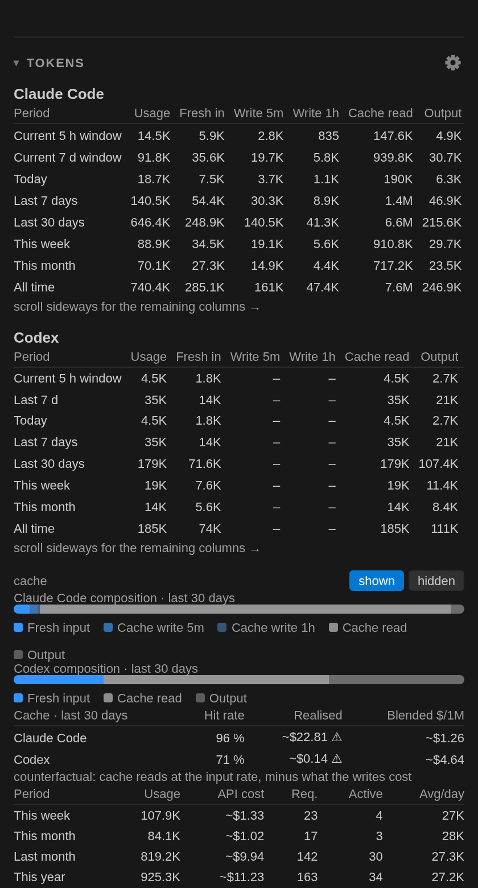

# Token Pace — Claude Code & Codex

Quota, tokens and API cost for **Claude Code** and **Codex**, permanently in the VS Code
status bar, with a detailed tooltip, a dashboard in the secondary sidebar, and text-only
views for the places a webview cannot go.

The bars are coloured by **pace**, not by level: green while consumption stays at or below
the share of the window that has already elapsed, yellow once it runs ahead of pace,
red when the window is spent. A 60 % bar is reassuring an hour before the reset and alarming
five minutes in — a fixed threshold cannot tell those apart.

```
CC 5h ██┃▁▁▁▁▁ 25% · resets 2h14m      CC 7d █████┃▁▁ 69% ▲ · resets 4d 6h
CDX 5h ███┃▁▁▁▁ 33% · resets 1h05m     CC Fable 7d █┃▁▁▁▁▁▁ 12% · resets 4d 6h
Σ 4.6M · today                         ~$1.23 · today
```




The pictures are rendered from **preview data** (*Token Pace: Preview Status Bar States*
and a synthetic snapshot), not from anybody's real usage.

**Requires VS Code 1.106 or newer.** The dashboard lives in the secondary sidebar, and
`contributes.viewsContainers.secondarySidebar` only became a stable contribution point in
1.106 (in 1.104 it was behind the `contribSecondarySideBar` proposed API). Editors built on an
older VS Code base — Cursor and Windsurf currently are — cannot install it until they rebase;
VSCodium tracks the VS Code releases and gets it from Open VSX.

Not affiliated with, endorsed by, or sponsored by Anthropic or OpenAI. “Claude” and “Codex”
are the trademarks of their respective owners and are used here only to name the tools whose
output is read.

## What you see

* **A status bar entry per quota window**, model-scoped ones included: a pace-coloured bar
  with the elapsed marker, the percentage and the countdown to the reset. `windowSelect`
  decides how many appear, `statusBar.show` which kinds exist and in which order, `density`
  how much text each one gets. → [Status bar](docs/status-bar.md),
  [every state it can show](docs/status-bar-states.md)
* **A tooltip with the whole picture**: the window table with used, elapsed, pace and reset,
  a forecast line per window, the token tables for today / 7 days / 30 days, the freshness
  line and a provenance line that names what was measured and what was estimated.
* **A dashboard in the secondary sidebar**: quota cards that explain their own colour, a
  seven-day sparkline, the key figures, the daily chart by model with the cost line, and the
  fixed-period token totals. → [Dashboard](docs/dashboard.md)
* **The same figures without a webview**: a markdown report, a searchable Quick Pick, a CSV
  and a JSON export, and a diagnostics report that is safe to paste into an issue.
  → [Export and diagnostics](docs/export.md)
* **Quota without the network.** Percentages come from the provider and cover every client;
  out of the box they are read from local sources somebody else wrote. Fetching them
  ourselves is a separate decision, asked once. → [Quota sources](docs/quota-sources.md)
* **Nothing invented.** A missing figure is `–`, never `0 %`; a window without a stated length
  gets no pace rather than an invented denominator; estimates carry `~` and lower bounds `⚠`.
  → [Numbers, words and pace](docs/numbers.md)
* **English and German.** With VS Code's display language set to German the whole interface is
  German, numbers and dates included; the debug log, the diagnostics report and the exports
  stay English so they can be pasted into an issue. → [Language](docs/dashboard.md)

## Install

* **Visual Studio Marketplace** — search for *Token Pace* in the Extensions view, or
  `code --install-extension frederik.token-pace`
  ([store page](https://marketplace.visualstudio.com/items?itemName=frederik.token-pace)).
* **Open VSX** — the same extension for VSCodium and everything else that uses that registry:
  `codium --install-extension frederik.token-pace`
  ([store page](https://open-vsx.org/extension/frederik/token-pace)).
* **`.vsix`** — download it from the
  [GitHub releases](https://github.com/mfvdp/VS-Code_Token-Usage/releases) and install with
  `code --install-extension token-pace-<version>.vsix`, or *Extensions → … → Install from
  VSIX…*. The package is platform-independent; there is no native code.

Nothing has to be configured. If Claude Code or Codex runs on the other side of a remote —
WSL, SSH, a container — see [Windows, WSL and remote development](docs/windows-wsl-remote.md).

## Privacy

Out of the box this extension makes **no network access at all**: token counts are read from
local transcript files, and quota percentages from local sources somebody else wrote — a cache
file, Claude Code's own status line, `~/.claude.json`, the Codex transcripts.

Fetching quota ourselves is a separate decision, asked for once, in a dialog that states
exactly what is sent where; the access token is read only then, only from
`~/.claude/.credentials.json`, and only ever sent to `https://api.anthropic.com/api/oauth/usage`.

`~/.claude/ide/*.lock`, `~/.claude/sessions/*.key` and the `oauthAccount` block of
`~/.claude.json` are **never** touched, and symlinks are not followed while scanning.

Transcript contents — prompts, responses, tool arguments and tool results — are never stored,
logged, exported or displayed, and nothing is written outside the extension's own storage
except the two opt-ins, each behind its own consent dialog.

No telemetry of any kind is collected, the webview loads no external resource, and
`npm run check:privacy` fails the build on any `http(s)` literal outside a small allow-list.
The full account is in [Privacy](docs/privacy.md).

## Documentation

| Page | What is in it |
|---|---|
| [Numbers, words and pace](docs/numbers.md) | Where every figure comes from, the nine terms used throughout, and the pace rule the colours follow |
| [Status bar](docs/status-bar.md) | What an entry is made of, the special states, the click, the tooltip, the colours, the preview |
| [Status bar states](docs/status-bar-states.md) | Every text the bar can show, which state wins when several apply, and the one thing to check |
| [Dashboard](docs/dashboard.md) | The sections of the panel, the filter bar, the chart, the tables and the heatmap |
| [Quota sources](docs/quota-sources.md) | The cache file, consent, our own fetch, the status-line bridge, extra usage |
| [The quota cache file](docs/quota-cache-format.md) | The contract for that JSON file, so you can write one yourself |
| [The “API cost” column](docs/cost.md) | The dated price table, the family fallback, and what the figure is not |
| [Counting](docs/counting.md) | How the transcripts are read, what a lower bound is, retention and the snapshot |
| [History and forecasts](docs/history.md) | The stored quota history, burn rate, ETA and the reset retrospective |
| [Budgets and alerts](docs/budgets-alerts.md) | Limits you state, the thresholds that can fire, and why a budget is not a bill |
| [Sessions and projects](docs/sessions.md) | What `attribution` stores, and the salted hash that keeps a screen share safe |
| [Export and diagnostics](docs/export.md) | The CSV and JSON schemas, the clipboard summary, the diagnostics report |
| [If the bar says …](docs/troubleshooting.md) | Every problem state with its cause and the repair its click performs |
| [Privacy](docs/privacy.md) | Every file read, everything never touched, and the one outbound call |
| [Windows, WSL and remote development](docs/windows-wsl-remote.md) | `extensionKind`, relocated directories, restricted and virtual workspaces |
| [Settings](docs/settings.md) | Every `tokenPace.*` key with its default and what it does |
| [Commands and keybindings](docs/commands.md) | The commands, the one chord, the interface language, the walkthrough |
| [Building and testing](docs/development.md) | Build, tests, the smoke test in a real window, and what CI runs |
| [Releasing](docs/release.md) | The tag-push recipe, the two store secrets, publisher verification |

Changes per version are in [CHANGELOG.md](CHANGELOG.md).

## Licence

**AGPL-3.0-or-later.** Copyright © 2026 Frederik Marx. The full text is in [LICENSE](LICENSE);
every source file carries an [SPDX](https://spdx.dev) identifier.

Copyleft was chosen deliberately. This extension reads an access token, and the only
meaningful assurance about what it does with it is that you can read the code. That
assurance should survive being passed on, by whichever route:

* **Distributed** as another extension, a `.vsix`, or inside a product — the complete source
  of the modified version has to be published under the same licence.
* **Run as a network service** — section 13 extends the same duty to people who only ever
  reach the software over a network, so a hosted dashboard built from this code owes its
  users the source as well. That is the difference between the AGPL and the plain GPL, and
  it is the reason for this choice: a quota dashboard is exactly the kind of thing that ends
  up hosted rather than shipped.

Using and modifying it for yourself carries no obligation whatsoever. The duty begins at
distribution or at offering a service, never at use, and forking this repository is neither.
